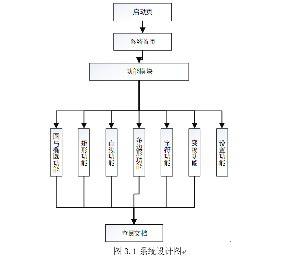

# 图元算法演示系统-Primitive Generation System

系统这个样子：


### 摘要

​	本文介绍了生成各种图元的算法原理，以及设计实现算法演示系统的方法，目的在于使算法的原理更加清晰直观。在计算机屏幕上展示各种图形，就是利用编程手段和数学方法，结合硬件特性，将一些基本的形状，也就是图元进行复杂的组合，变换，本质上就是利用这些方法，手段，特性控制屏幕上的像素点的位置，明暗程度。正是这一技术的不断发展与突破，才使得我们现代人的电子屏幕世界是那么得丰富多彩。

​	本系统为二维图元生成算法演示系统，是利用WPF，Windows编程技术，以XAML实现用户界面，以C#实现程序逻辑，包括界面交互逻辑，算法逻辑等。系统使用微软Visual Studio 2017集成开发环境开发而成，小巧精美，可运行在Windows7，Windows8，Windows10等主流版本的Windows操作系统上，使用者可以利用这个系统快速了解二维图元生成的算法原理，并能查阅相关算法的说明文档。

​	关键词：图元 WPF(C#) Windows编程


### ABSTRACT

​	This paper introduces different algorithm priciples of different primitives and the way to develop Geometric Primitive Generation System, which can make us konw the algorithm priciples clearly with the help of this system. The point that displays different shapes on different screens is using the methods of programming and Mathematical techniques to caculate the location of different pixel, which is the base of Geometric Primitive.It focuses on the mathernatical and computatioanal foundations of image generation and processing rather than purely aesthetic issues. Thanks to this magical techonology, our screen world becomes so colorful and richful. 

​	The system is 2D Geometric Primitive Gemeration System. It developed with WPF(C#), windows programing technology using Visual Studio 2017. It uses XAML to form the user interface, CSharp to implement algorithmic logic. The system can be installed on the popular windows operation system, such as Windows7, Windows8, Windows10. Users can learn about the basic algorithm principles quickly and consult the introduction documents via the Geometric Primitive system.

​	Keywords**：**Geometirc Primitive  WPF(C#)  Windows Programming


### 1 绪  论

#### 1.1 课题背景

​	二维计算机图形技术广泛应用在印刷制图、地理制图，广告制图领域[1]。通过一系列基本形状的组合、旋转、放缩，使得计算机绘图二维制图领域取得巨大成功[2]。

​    而随着社会数字信息化水平的不断提高，用电子设备传递信息的要求也越来越高。这就要求人们能在电子屏上更快更好地绘制出需要的图形。要更快更好地绘制图形，就十分有必要对生成这些基本形状的算法进行研究[3]。 

#### 1.2 研究重点

​	计算机图形学研究的是利用计算技术将图形信息可计算化。关注的核心问题是：对图形进行数学计算而后在电子屏幕上展示出来。图元是系统可处理的最简单的图形对象。在二维计算系统中，图元是一系列的直线、圆、多边形，曲线。在三维处理系统中，图元是球、立方体、环曲面、锥体、柱体等。本系统研究的是二维计算系统中图元的生成算法。除了核心的图元生成算法外，还额外包括了文字绘制，二维变换，平移，旋转的实现算法。利用这个系统，就可以快速了解到图元算法的基本原理。另外，通过系统提供的文档，就能对图元算法的原理有更加清晰的认识。

#### 1.3 历史发展与现状 

​    计算机图形学是随着计算机的诞生发展而逐渐诞生发展起来的。起初计算机主要用于科学计算，虽然尚不普及，但是已经开始配置图形显示器。尽管那时只能显示一些简单的图形，还不具备人机交互的能力。后来由于军事需要和工商业需要，计算机图形学得到了蓬勃的发展。到20世纪70年代，计算机图形学技术开始进入实用化阶段，开始逐渐进入事务管理领域和教育科研领域。那时，以小型计算机和超级小型机为基础的图形系统进入市场并成为主流。但是，由于图形硬件设备价格昂贵且功能简单，基于图形的应用软件还很匮乏，直到20世纪80年代初，计算机图形学还是一个很小的学科领域。

​    后来，GUI(Graphical User Interface)的出现，涌现出大量使用方便，价格低廉的应用软件。到20世纪90年代，计算机图形技术已经在三维乃至高维计算领域取得了飞速发展。

​    二维计算机图形技术起源于20世纪50年代。起初使用在支持矢量绘图的设备中。随着硬件性能的提高，最终二维绘图技术在应用点图处理系统的设备上得到极大支持[4]。后来随着算法的不断改进，二维绘图技术更是获得了前所未有的广泛应用，取得了巨大的成功。在当代各种计算机系统中有着不可替代的地位。

​	目前有许多功能齐全的图形库可供我们使用。如OpenGL、 GDI、 GDI+、 DirectX、QuickDraw、MiniGL，SFML等等。这些库定义了一整套图元生成算法，完全适用于二维图形绘制。只需调用一个库中定义好的函数就能够快速生成一个合乎需要的图形。

#### 1.4 系统应用

​	二维绘图技术包括了矢量图绘制技术、位图绘制技术、文本绘制技术，图形变换技术。矢量图绘制技术与位图绘制技术具体实现在规定的坐标系统中绘制一系列图元；文本绘制技术主要实现绘制需要的文本，包括文字内容的设定、文字样式的设定、文字大小的设定、文字颜色的设定、文字位置的设定，文字方向的设定等；图形变换技术包括图形的平移、旋转，放缩等内容。

​	设计这个系统的目的不在于调用基础库提供的方法来制作复杂炫目的图形，而在于利用此系统让使用者能够快速、清晰，直观地了解基本的二维绘图方法，和生成各种图元的算法原理。


### 2 关键技术研究

#### 2.1 WPF技术

​    WPF全称是Windows Presentation Foundation，即Windows呈现基础，是微软推出的用于将界面展现与程序逻辑分离的嵌套于.NET Framework的技术。它采用XAML描述界面。XAML文档，是微软创造的，一种类似于XML的文档。WPF定义了一整套描述界面元素的标记，在XAML中调用，能使制作出的界面结构清晰，美观绚丽[5]。

​	WPF由两个部分组成：引擎和框架。WPF强大的引擎，使得应用程序不仅能够充分利用现代计算机中现有的图形硬件的全部功能，而且还能够利用硬件将来的新特性。另外，WPF庞大完整的框架体系为媒体、用户界面设计和文档提供的解决方案远远超过开发人员现在所拥有的。

​	使用WPF技术开发Windows桌面应用程序，可以做到编程人员与设计人员职能分离。这与传统WinForm应用程序开发不同。利用WPF技术，设计人员只需利用微软提供的Expression Studio套件工具设计出XAML，然后将XAML文档交付给编程人员就行了。这样做的好处是细化了开发工作，减轻了程序开发人员的负担，一定程度上降低了系统维护的成本，缩短了程序开发周期，提高了开发效率。

​	WPF技术已经十分成熟，由于这个技术综合了窗体、文档、视频，三维及其它功能，所以企业可以创建功能强大的，使用持久的用户体验解决方案。而对于设计人员，WPF提供的平台可消除内容、媒体和应用程序之间的边界。另外，WPF技术会根据数据的不同对UI进行不同的表达，即数据驱动UI。这与WinForm事件驱动的模式有很大的不同。

​	总之WPF功能十分强大，是当前构建Windows桌面应用程序的主流方案，也是最为经典的构建方案之一。

#### 2.2 C#技术

​	系统使用C#构建程序逻辑。C#，又叫C Sharp，也是微软创造的一种支持面向对象编程的语言。C#可以通过内置的服务，使组件可以转化为XML网络服务；C#提供的安全机制可以避免类型转换、数组越界等安全问题；C#可以在.NET框架下同其它语言，如VB，J#等转换；且微软为C#的类库框架提供了丰富的API以及完备的文档，功能强大的开发集成环境[6]。因此能够快速便捷地构建出合乎需要的Windows桌面应用程序。

​    C#在某种程度上可以看作是.NET面向Windows环境的一种编程语言。微软在正式场合把C#描述为一种简单、现代、面向对象、类型非常安全、派生自C和C++的编程语言。它同时具有Visual Basic 的易用性，以及C++的高性能、低级内存访问的特性。因此C#比其它语言更适合现代开发工具[7]。


### 3 系统整体设计

#### 3.1 设计目标

​	目标是使用者打开这个系统后，能够根据点击的项的不同演示不同功能：图元生成功能、文字显示功能，二维变换功能；并能设置演示属性，如填充点的颜色；随时查看相关算法说明文档。旨在让使用者借助这个系统，对计算机图形学中生成二维图元的算法，简单的图形变换算法有更加清晰的理解。

#### 3.2 系统设计图



 

​       根据系统设计图3.1所示，系统经过启动页进入系统首页。进入系统后，使用者可以选择感兴趣的功能模块进行算法演示。可演示的功能模块有圆与椭圆功能模块、矩形功能模块、直线功能模块、多边形功能模块、字符功能模块，变换功能模块。这六个模块与查阅文档的功能模块相连通，可以在执行演示功能的时候随时查阅文档说明。另外，系统在首页，设置演示属性模块时不能执行文档查阅功能。

####  3.3 文档设计

​    WPF提供了专门描述文档的XAML标记`<FlowDocument></FlowDocument>`。可以在FlowDocument标记中添加段落、图像、表格、列表，超链接等内容；并可用一般XAML定义Style的方式定义文档各个元素的样式。描述出来的文档结构就像HTML文档一样，十分清晰简洁，但又不像HTML那样文档结构完全被外部所见。因此，内容安全程度高[8]。

​	FlowDocument文档定义在单独的Page页中，这样就可以为FlowDocument添加cs交互逻辑文档。另外，由于文档是定义在单独的Page页中，每个Page页就代表了一篇独立的文档。这样，文档就可以用来单独描述某个功能而不必担心文档间的耦合程度。因此，维护文档的工作就变得十分简单轻松。

#### 3.4 算法原理

##### 3.4.1圆与椭圆算法模块

（1）中点画圆法。该算法的目标是根据决策参数的初始值找到圆周上的一个像素点。使得圆周上的点与圆心尽可能满足方程[9]：


公式（3-1）中的x表示圆周上的点距离圆心在横轴方向的距离；y表示圆周上的点距离圆心在纵轴方向的距离；r代表待绘制圆的半径长。

决策方程如下：


用C#描述的中点画圆算法如下图3.3所示：


中点画圆算法只能用到整数的加法、减法和左移（乘2）运算，效率高且适合用硬件实现。

（2）Bresenham画圆法。这个算法是对中点画圆算法的改进。通过改变决策参数系数值的大小来调节圆生成效果的算法，其本质还是中点画圆算法。Bresenham画圆法算法原理如下图3.4所示：


图3.4 Bresenham画圆法


对应的算法如下图3.5所示：


图3.5 正负判断画圆法

（4）快速画圆法。判别式的计算只用了加减法，并无采用任何乘法。因而，理论上应该比中点画圆法，正负判定画圆法更加快速绘制出一个圆。

（5）中点画椭圆法。与中点画圆算法类似，该算法的目标是根据决策参数的初始值找到圆周上的一个像素点。使得圆周上的点与圆心尽可能满足方程[10]：


公式（3-2）中的x表示椭圆圆周上的点距离圆心在横轴方向的距离；y表示椭圆圆周上的点距离圆心在纵轴方向的距离；a表示椭圆圆周与圆心在x轴上的截距；b表示椭圆圆周与圆心在y轴上的截距。

决策方程如下：


核心算法如下图3.6所示：


（6）Bresenham画椭圆法。这是通过调整中点画椭圆算法中的决策变量的系数值来改进椭圆生成效果的算法，本质还是中点椭圆算法。唯一的差别是在长半短轴取值为非整数的情况下，画出的椭圆效果不同。算法如下图3.7所示：


3.4.2矩形算法模块

（1）矩形生成（不填充）。在演示区域生成一个矩形，但不填充它。即只描了矩形的边。也就是说只点亮矩形边上的像素点。实现的算法如图3.8所示：


（2）矩形生成（填充）。在演示区域生成一个矩形，并把矩形所在区域的所有像素点点亮。实现矩形填充的算法如下图3.9所示：


3.4.3直线算法模块

（1）DDA画线法。又叫数值微分画线法，是一种线段扫描转换算法。通过在一个坐标轴上以单位间隔对线段取样，从而确定另一个坐标轴上最靠近线路径的对应整数值[11]。这种方法由于有浮点数运算与取整操作，因此不利于硬件实现[12] 。

   

 

 


（2）中点画线法[13]。该方法根本目的在于选出离理想直线（给出的两个端点的连线）最近的像素点作为直线上的点。


实现的算法如图3.14所示：


 

同理还有自左往右趋势往上画线、自右往左趋势往下画线、自右往左趋势往上画线。

 

3.4.4多边形算法模块

（1）正三角形生成。系统提供了两种生成正三角形的方法。第一种是确定了三角形的定点分别计算出底边两个定点的坐标来绘制正三角形。第二种是通过底边左顶点的坐标和边长来计算出另外两个定点的坐标，从而绘制正三角形的方法。

第一种绘制正三角形的算法如下图3.15所示： 


（2）正方形生成。通过调用矩形生成模块的不填充算法来绘制正方形。算法如下图3.17所示：


 

（3）任意多边形。通过输入任意个顶点的坐标来绘制多边形的方法。算法原理是根据各点坐标，通过调用DDA画线法依次连接各个点，形成闭合的图形的方法。实现的算法如下图3.18所示：


 

3.4.5字符算法模块

（1）英文字符。

（2）汉字。

（3）特殊字符。

​	这三个子模块的展示字符的原理是相同的。系统预先定义了若干个不同字体的储存了文字点阵(50*50)信息的位图文件。通过C#提供的文件读取方法逐个读取文件中每个像素点，从而在演示区域展示出不同的可见字符。

加载图像的方法如下图3.20所示：


 

3.4.6变换算法模块

（1）平移算法。演示此模块前，系统会先显示一条初始线段。点击演示按钮后，系统会调用平移算法将此条直线平移到设定位置。平移算法如下图3.21所示：


 

其中CSys.RefreshCordinateSys()是刷新坐标系的方法。CSys.DrawDots()是在坐标系中绘制点的方法。


 

3.4.7设置演示属性模块

（1）填充点颜色设置。点击此项可以将填充点（像素点）的颜色设置成某个颜色。目前可以设置的颜色有：橙色、黑色、红色、粉红色、绿色、紫色、灰色，蓝色等。

 

 

3.6 界面设计

首页设计效果如图3.22所示


 

首页分为五个部分：

​	第一部分是标题栏。此栏又分为三部分。第一部分是系统图标；第二部分是系统标题；第三部分是最小化和最大化按钮。点击系统图标将弹出系统菜单。效果如下图3.23所示：


 

​	点击最小化按钮将使窗体最小化；点击关闭按钮将使窗体关闭。鼠标悬停其上都将弹出功能提示。效果如下图3.24所示：


 

​	首页第二部分是左侧菜单栏。此栏有八个图标。分别代表返回首页功能、圆与椭圆算法模块演示功能、矩形算法模块演示功能、直线算法模块演示功能、多边形算法模块演示功能、字符算法模块演示功能、变换算法模块演示功能，设置演示属性功能。鼠标指针悬停在此八个图标上都会弹出对应的功能提示。如下图3.25所示：


 

​     第三部分是功能列表栏。点击左侧菜单栏对应图标将在功能列表添加相应的功能项。图3.26表示点击了直线算法演示功能模块后的列表项：

 


 

点击列表项中的某项，将在演示区域演示对应功能。图3.27为中点画圆法的演示效果。


 

第四部分是演示区域。默认效果如图3.22与下图3.28所示。开始演示后效果如图3.27所示。

 

 

​	点击运行按钮将启动演示功能。图3.30展示了要进行旋转算法演示而未点击演示按钮前的演示区状态；图3.31则是点击了演示按钮的演示区状态。另外，需注意的是：演示功能只在进行平移，旋转操作时有效。

 

 

设置颜色界面如图3.32，图3.33，图3.34所示：


 


3.7 其它关键源码分析

3.7.1数据项结构

​	图元生成算法演示系统没有引入数据库，项目部署后唯一存储于外部的数据是关于功能项的。记录功能项的信息是一XML文档。文档包括一个Root根节点，七个记录左侧菜单栏功能的FucList节点；其中每个FuncList节点又包括若干个Item节点；Item节点记录了需要在功能列表栏中显示的功能项。

​	系统通过读取这个XML文档来显示具体的功能项。系统有否某个演示功能全靠这个文档。可以通过删除Item项的方式删除系统演示功能。此XML文档结构定义如下：

```xml
<?xml version="1.0" encoding="utf-8" ?>
<Root>
  <FuncList type="Circle">
    <Item>中点画圆法</Item>
    <Item>Bresenham画圆法</Item>
    <Item>正负判定画圆法</Item>
    <Item>快速画圆法</Item>
    <Item>中点画椭圆法</Item>    
    <Item>Bresenham画椭圆法</Item>    
  </FuncList>

  <FuncList type="Square">
    <Item>矩形生成（不填充）</Item>
    <Item>矩形生成（填充）</Item>
  </FuncList>

  <FuncList type="StraitLine">
    <Item>DDA画线法</Item>
    <Item>中点画线法</Item>
    <Item>Bresenham画线法</Item>
  </FuncList>

  <FuncList type="Polygon">
    <Item>正三角形</Item>
    <Item>正方形</Item>
    <Item>任意多边形</Item>
  </FuncList>

  <FuncList type="Character">
    <Item>Aa-Consolas</Item>
    <Item>Bb-Consolas</Item>
    <Item>Cc-Consolas</Item>
    <Item>Dd-Consolas</Item>
    <Item>Ee-Consolas</Item>
    <Item>Ff-Consolas</Item>
    <Item>Gg-Consolas</Item>
    <Item>Hh-Gabriola</Item>
    <Item>善</Item>
  </FuncList>

  <FuncList type="Transform">
    <Item>平移算法</Item>
    <Item>旋转算法</Item>
  </FuncList>

  <FuncList type="Setting">
    <Item>填充点颜色</Item>
  </FuncList>
</Root>
```

3.7.2单元格填充

​	系统有了坐标系后，还需要在坐标系上绘制一些点。通过这些点的位置来模拟不同的形状：字形，图形等。

​	填充单元格的意义就在于：通过计算得到坐标系中每个单元格的坐标位置与每个单元格的边长后，在单元格的位置再绘制一个填充了某个颜色的矩形，这样就代表了坐标系某位置有点。填充单元格的方法如下所示：

```c#
/// <summary>
/// 画一个矩形。此方法用于填充网格的交叉线围成的矩形
/// </summary>
private static void DrawRectangle(Point rectLoc)//画矩形
{
    DoubleCollection dCollection = new DoubleCollection();//设置线型为虚线
    dCollection.Add(2);
    dCollection.Add(3);
    RectangleGeometry myRectangleGeometry = new RectangleGeometry();//设置矩形属性

    Rect myRect = new Rect();
    myRect.X = rectLoc.X * Width / CellNum;
    myRect.Y = rectLoc.Y * Height / CellNum;
    myRect.Width = Width / CellNum;
    myRect.Height = Height / CellNum;
    myRectangleGeometry.Rect = myRect;

    Path myPath = new Path();
    myPath.Stroke = Brushes.Gray;//边线颜色为灰色
    myPath.StrokeThickness = 1;//边线宽为1
    myPath.Data = myRectangleGeometry;
    myPath.StrokeDashArray = dCollection;

    //根据设定的颜色确定填充点的颜色
    switch(CanvasContentColorPicker.ColorUserDefintion)
    {
        case "Orange":
        myPath.Fill = Brushes.Orange;//填充为Orange色
        break;       
            
        case "Black":
        myPath.Fill = Brushes.Black;//填充为Black色
        break;

        case "Red":
        myPath.Fill = Brushes.Red;//填充为Red色
        break;

        case "Pink":
        myPath.Fill = Brushes.Pink;//填充为Pink色
        break;

        case "Green":
        myPath.Fill = Brushes.Green;//填充为Green色
        break;

        case "Purple":
        myPath.Fill = Brushes.Purple;//填充为Purple色
        break;

        case "Gray":
        myPath.Fill = Brushes.Gray;//填充为Gray色
        break;

        case "Blue":
        myPath.Fill = Brushes.Blue;//填充为Blue色
        break;

        default:
        break;
    }
}

canvas.Children.Add(myPath);//把图像添加到待返回的临时canvas对象上

```

​	根据上面函数的定义，要执行此方法，首先得计算出某个单元格的坐标值。计算方法如公式3-9所示；然后将坐标值传入。这样就能点亮指定位置的点。


### 4 软件测试与发布

#### 4.1 系统测试与功能测试

​	系统测试，是对整个系统的测试，将硬件、软件、操作人员看作一个整体，检验它是否有不符合系统设计要求的地方或有程序漏洞[14]。通过系统测试环节，可以有效地保证软件（系统）的正确性与稳定性[15]，提高软件的质量水平[16]。

​    功能测试，主要检测系统是否满足各方面功能的使用要求。除一般的功能性检查外，功能测试还要针对不同环境进行测试。功能测试主要测试的内容有[17]：

（1）  程序能够正常安装启动，有相应错误提示。

（2）  功能是否符合实际要求。

（3）  界面是否清晰、美观。

（4）  菜单、按钮是否操作正常、灵活，能处理一些异常操作。

（5）  数据的输出结果是否准确，格式清晰，可以保存和读取。

（6）  功能逻辑是否清楚，符合使用者的习惯。

（7）  软件升级后，是否能继续支持旧版本的数据。

总之，测试的目的就是及时发现软件中存在的问题。越早发现软件中存在的问题，开发费用就能降得越低；而软件质量越高，软件发布后的维护费用就越低[18]。

#### 4.2 测试结果

​    对最终版本的系统进行系统测试与功能测试后发现各个模块功能无缺失或异常，且能在不同版本windows系统下均能正常运行。程序可以正常发布。

#### 4.3 软件发布

​    软件发布是软件开发过程的最后一个环节。发布的第一步是构建安装包[19]。

​	首先安装插件Microsoft Visual Studio 2017 Installer Projects到Visual Studio中。然后正式创建Visual Studio安装器项目。将主程序和外部资源文件打包，创建桌面快捷方式图标，设置安装界面的提示信息，最后执行生成项目操作。这样就生成了msi安装包。双击此安装包就能在目标机上部署图元生成算法演示系统。

#### 4.4 软件维护

​	软件维护主要有：改正性维护、适应性维护、完善性维护和预防性维护[20]。完善性维护主要是为系统增加新的功能[21]。为了方便后续的维护，必须要对当前版本的源码进行保存。可将源码上传到指定服务器，也可保存到本地。保存前，还应当做一份详细的版本说明文件，记录下当前版本的特性，之后和源码一起保存。

​	在本系统中，构建出的系统只能演示一些基本的图形学算法，而在线宽与线型处理、图元反走样，图元属性的设定，几何变换和二维观测与二维变换方面仍有不完善的地方。因此需要后期进行完善性维护。

 

### 5 总结

​	在计算机设备上生成图元，关键是要有一套生成图元的算法。如要在设备上生成圆，有中点画圆算法、Bresenham画圆法，正负判定画圆法；要生成线段，有DDA画线法、Bresenham画线法、中点画线法等。运用不同算法，可以得到不同拟合程度形状。而要在计算机设备上画出复杂多彩的形状与效果，就需要做更多额外工作。如线宽与线型处理、反走样处理、色调处理，投影变换等。因此，需要我们用数学方法，结合硬件特性研究合适的处理算法。

 
